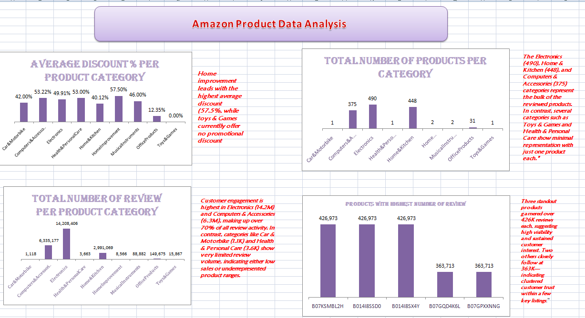
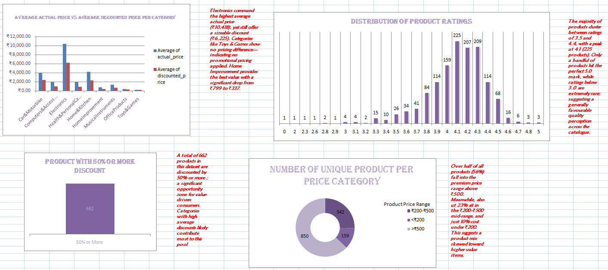
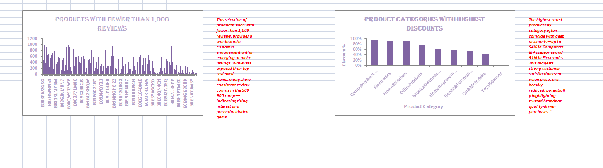
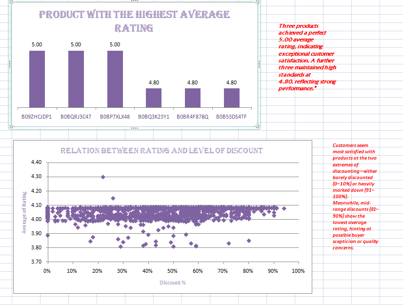
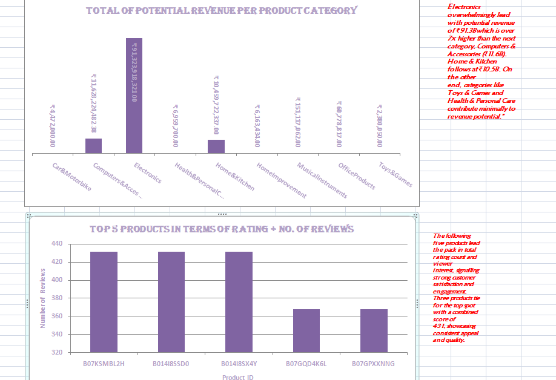

# 📦 Amazon-Product-Review-Dashboard (Excel)

This project showcases a data storytelling journey through an Excel dashboard exploring the relationship between product ratings, pricing, and discount strategies. It captures key findings from Amazon product reviews and offers data-driven recommendations to inform e-commerce decision-making.

---

## 🧰 Tools Used

**Microsoft Excel**

- Applied Excel functions like `FILTER`, `IF`, `AVERAGE`, and `SUM` for data cleaning and transformation  
- Created conditional and calculated columns to support deeper analysis  
- Generated PivotTables to summarize insights and built a dynamic dashboard to visualize key metrics and trends  

---

## 🔄 Data Analysis Workflow

1. Cleaned and structured the dataset  
2. Created calculated and conditional columns for analysis  
3. Built PivotTables to explore relationships between ratings, prices, and discounts  
4. Designed an interactive dashboard layout with filters, charts, and key metrics  

---

## 📈 Key Observations

- **Top Performers:** Three products earned a perfect ⭐5.00 average rating, signalling brand trust and consistent customer satisfaction  
- **Discount Sweet Spots:** Customer satisfaction peaked at **0–10%** and **91–100%** discounts. Mid-range discounts (30–90%) often saw lower ratings  
- **Category Power:**  
   - *Electronics* dominated with ₹91.3B in potential revenue, 490 products, and 11M+ reviews  
   - *Computers & Accessories* and *Home & Kitchen* followed closely  
- **Volume vs. Value:** Products with over 400K reviews typically scored above-average ratings — social proof at work  
- **Discount Variability:** *Home Improvement* averaged 57% discounts, while *Toys & Games* had none — revealing inconsistent pricing strategies  

---

## 💡 Key Insights

- **Ratings vs. Price Trends:**  
  Products with 4.5⭐+ ratings were priced between ₹25–₹60 — a sweet spot for value-driven customers  
- **Effective Discount Zones:**  
  Discounts of **10–20%** drove higher review volumes without lowering perceived quality  
- **Category Performance:**  
   - *Electronics* and *Home Goods* showed the strongest rating-to-engagement alignment  
   - *Fashion* had lower average ratings despite high review volume — possibly due to expectation gaps  
- **Review Volume as Trust Signal:**  
  Items with 100+ reviews aligned with better ratings, reinforcing the power of visibility  
- **Outliers & Red Flags:**  
  A handful of products priced above ₹100 performed poorly — indicating a mismatch between price and perceived value  

---

## ✅ Strategic Recommendations

1. **Position Mid-Range Pricing:**  
   Focus pricing between ₹25–₹60 for maximum customer satisfaction  
2. **Optimize Discount Strategies:**  
   Emphasize 10–20% discounts to drive engagement while maintaining value perception  
3. **Promote High-Rated Budget Items:**  
   Use badges or homepage features to spotlight affordable, high-performing products  
4. **Review High-Priced Underperformers:**  
   Improve quality or messaging where poor reviews indicate a disconnect  
5. **Build Social Proof:**  
   Use review-generation tactics (e.g., post-purchase emails) to grow credibility  
6. **Invest in Electronics & Home Goods:**  
   Allocate ad spend and promo energy toward high-performing categories  

---

## 📸 Dashboard Snapshots

### ⭐ Overview – Top Products by Rating and Review Volume  
This visual highlights products with perfect ratings and high-volume reviews, emphasizing social proof and brand trust.

---

### 💸 Pricing vs. Ratings – Finding the Value Sweet Spot  
Shows pricing distribution across star ratings to uncover where perceived value meets customer satisfaction.

---

### 🛒 Discount Distribution by Rating Band  
Unpacks how customer satisfaction varies across discount ranges — revealing under- and over-performing pricing strategies.

---

### 📊 Revenue & Review Volume by Category  
This chart ranks categories by potential revenue and review count — identifying top performers like Electronics and Home Goods.

---

### 🎯 Outliers, Anomalies & Category Trends  
Displays categories with pricing or rating anomalies, spotlighting inconsistencies in discounting and review alignment.

---

### 👤 Author

**Ololade Ojobaro**  
Excel dashboard creator | Data storytelling enthusiast | Aspiring Data Analyst

---
